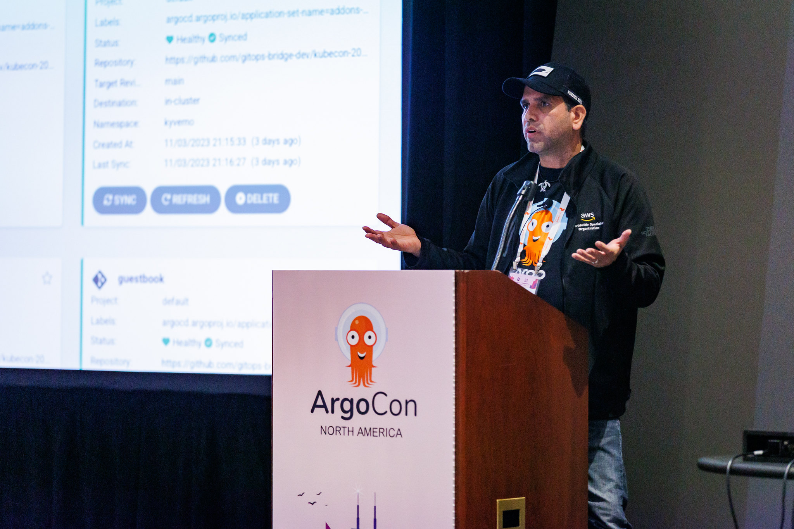

------
layout: blog
title: "Kubernetes読書会を覗く"
slug: k8s-book-club
date: 2024-02-22
---

**著者**: Frederico Muñoz (SAS Institute)

Learning Kubernetes and the entire ecosystem of technologies around it is not without its
challenges. In this interview, we will talk with [Carlos Santana
(AWS)](https://www.linkedin.com/in/csantanapr/) to learn a bit more about how he created the
[Kubernetes Book Club](https://community.cncf.io/kubernetes-virtual-book-club/), how it works, and
how anyone can join in to take advantage of a community-based learning experience.

Kubernetesとそれを取り巻く技術のエコシステム全体を学ぶことは、課題がないわけではありません。
このインタビューでは、[Carlos Santana (AWS)](https://www.linkedin.com/in/csantanapr/)氏に、彼がどのようにして[Kubernetes Book Club](https://community.cncf.io/kubernetes-virtual-book-club/)を作ったのか、それがどのように機能するのか、そしてコミュニティベースの学習体験の利点を得るために誰もがどのように参加することができるのかについて、もう少し伺います。

**Frederico Muñoz (FSM)**: 

Hello Carlos, thank you so much for your availability. To start with,
could you tell us a bit about yourself?

こんにちはCarlosさん、時間をとってくれてありがとう。
まずはじめに、ご自身のことを少し教えていただけますか？

**Carlos Santana (CS)**: 
もちろんです。
6年前に本番環境でKubernetesをデプロイした経験が、[Knative](https://knative.dev/)に入社するきっかけとなり、その後リリースチームを通じてKubernetesに貢献しました。
アップストリームのKubernetesでの作業は、私がオープンソースで得た最高の経験のひとつです。
過去2年間、AWSのシニア・スペシャリスト・ソリューション・アーキテクトとしての役割で、私は大企業がKubernetes上に社内開発者プラットフォーム(IDP)を構築するのを支援してきました。
今後、私のオープンソースへの貢献は、[Argo](https://github.com/argoproj)や[Crossplane](https://www.crossplane.io/)、[Backstage](https://www.cncf.io/projects/backstage/)のようなCNCFのプロジェクトや[CNOE](https://cnoe.io/)を対象にしています。

## 読書会の創設

**FSM**: それであなたがKubernetesに辿り着いたわけですが、その時点で読書会を始めた動機は何だったのでしょうか？

**CS**: 

The idea for the Kubernetes Book Club sprang from a casual suggestion during a
[TGIK](https://github.com/vmware-archive/tgik) livestream. For me, it was more than just about
reading a book; it was about creating a learning community. This platform has not only been a source
of knowledge but also a support system, especially during the challenging times of the
pandemic. It's gratifying to see how this initiative has helped members cope and grow. The first
book [Production
Kubernetes](https://www.oreilly.com/library/view/production-kubernetes/9781492092292/) took 36
weeks, when we started on March 5th 2021. Currently don't take that long to cover a book, one or two
chapters per week.

Kubernetes読書会のアイデアは、[TGIK](https://github.com/vmware-archive/tgik)のライブ配信での何気ない提案から生まれました。
私にとって、それは単に本を読むということ以上に、学習コミュニティを作るということでした。
このプラットフォームは知識の源であるだけでなく、サポートシステムでもありました。とくにパンデミックの困難な時期にはです。
この取り組みが、メンバーたちの対処と成長をどのように助けたのかを見ることは喜ばしいことです。
最初の本[Production Kubernete](https://www.oreilly.com/library/view/production-kubernetes/9781492092292/)は、2021年3月5日に始めたときは36週間かかりました。
現在は、1冊の本をカバーするのにそれほど時間はかからず、1週間に1章か2章です。

**FSM**: 
Kubernetes読書会の仕組みについて教えてください。どのように本を選び、どのように読み進めるのですか？

**CS**: 
私たちは、グループの関心とニーズに基づいて本を共同で選んでいます。
この実践的なアプローチは、メンバー、とくに初心者が複雑な概念をより簡単に理解するのに役立ちます。
週次のシリーズが2つあり、EMEAのタイムゾーンのものと、私がUSで組織しているものです。
各オーガナイザーは共同ホストと協力してSlack上で本を選び、各章の議論するために、数週間に渡りホストのラインナップを整えます。

**FSM**: 
私の記憶が間違っていなければ、Kubernetes読書会は17冊目に突入しています。
物事を活発に保つための秘密のレシピがあるのですか？

**CS**: 
The secret to keeping the club active and engaging lies in a couple of key factors.

読書会を活発で魅力的なものに保つ秘訣は、いくつかの重要な要素にあります。

Firstly, consistency has been crucial. We strive to maintain a regular schedule, only cancelling
meetups for major events like holidays or KubeCon. This regularity helps members stay engaged and
builds a reliable community.

まず、一貫性が重要です。
休みの日やKubeConのような大きなイベントの時だけミーティングをキャンセルして、定期的なスケジュールを維持するよう努力しています。
この規則性は、メンバーの参加を維持し、信頼できるコミュニティを築くのに役立っています。

Secondly, making the sessions interesting and interactive has been vital. For instance, I often
introduce pop-up quizzes during the meetups, which not only tests members' understanding but also
adds an element of fun. This approach keeps the content relatable and helps members understand how
theoretical concepts are applied in real-world scenarios.

次に、セッションを面白く、対話式のものにすることが重要です。
たとえば、ミートアップ中にポップアップ・クイズを頻繁に導入します。これはメンバーの理解度をテストするだけでなく、楽しみの要素も加えています。
このアプローチによって内容の関連性が維持され、理論的な概念が実社会のシナリオでどのように適用されるかをメンバーが理解するのに役立ちます。

## 読書会で扱うトピック

**FSM**: The main topics of the books have been Kubernetes, GitOps, Security, SRE, and
Observability: is this a reflection of the cloud native landscape, especially in terms of
popularity?

書籍の主なトピックは、Kubernetes、GitOps、セキュリティ、SRE、Observabilityになっています。
これは、とくに人気という観点で、クラウドネイティブランドスケープの反映でしょうか？

**CS**: Our journey began with 'Production Kubernetes', setting the tone for our focus on practical,
production-ready solutions. Since then, we've delved into various aspects of the CNCF landscape,
aligning our books with a different theme.  Each theme, whether it be Security, Observability, or
Service Mesh, is chosen based on its relevance and demand within the community. For instance, in our
recent themes on Kubernetes Certifications, we brought the book authors into our fold as active
hosts, enriching our discussions with their expertise.

私たちの旅は『Production Kubernetes』から始まり、実用的な本番環境向けのソリューションに焦点を当てる方向性を設定しました。
それ以来、私たちはCNCFランドスケープのさまざまな側面を掘り下げ、異なるテーマに沿って本を揃えています。
各テーマは、それがセキュリティであれ、観測可能性であれ、サービスメッシュであれ、コミュニティ内の関連性と需要にもとづいて選択されています。
たとえば、Kubernetes認定に関する最近のテーマでは、書籍の著者を積極的なホストとして参加させ、彼らの専門知識で議論を充実させました。

**FSM**: 

プロジェクトに最近変化があったことは知っています。[Cloud Native Community Group](https://community.cncf.io/)としてCNCFに統合されたことです。
この変更について少しお話いただけますか？

**CS**: 

The CNCF graciously accepted the book club as a Cloud Native Community Group. This is a
significant development that has streamlined our operations and expanded our reach. This alignment
has been instrumental in enhancing our administrative capabilities, similar to those used by
Kubernetes Community Days (KCD) meetups. Now, we have a more robust structure for memberships, event
scheduling, mailing lists, hosting web conferences, and recording sessions.

CNCFは、読書会をCloud Native Community Groupとして快く受け入れてくれました。
これは、私たちの運営を合理化し、影響範囲を拡大する重要な進展です。
この連携は、Kubernetes Community Days(KCD)のミートアップで使用されているものと同様に、管理機能の強化に役立っています。
現在では、メンバーシップ、イベントのスケジューリング、メーリングリスト、Webカンファレンスの開催、セッションの記録など、より強固な体制が整っています。

**FSM**: 

CNCFとの関わりは、この半年間のKubernetes読書会の約束や成長にどのような影響を与えましたか？

**CS**: 

Since becoming part of the CNCF community six months ago, we've witnessed significant
quantitative changes within the Kubernetes Book Club. Our membership has surged to over 600 members,
and we've successfully organized and conducted more than 40 events during this period. What's even
more promising is the consistent turnout, with an average of 30 attendees per event. This growth and
engagement are clear indicators of the positive influence of our CNCF affiliation on the Kubernetes
Book Club's reach and impact in the community.

半年前にCNCFコミュニティの一員になって以来、Kubernetes読書会では大きな定量的な変化を目の当たりにしてきました。
会員数は600人以上に急増し、この間に40以上のイベントを企画・実施することに成功しました。
さらに期待されるのは、1回のイベントに平均30人が参加するという安定した動員数です。
この成長と約束は、コミュニティにおける影響やKubernetes読書会の影響範囲に関して、私たちのCNCF加盟が肯定的な影響である明確な指標です。

## 読書会に参加する

**FSM**: 

参加を希望する人は、どうすればいいのでしょうか？

**CS**: 

参加するためには3つの段階があります。
- まず、[Kubernetes読書会コミュニティ](https://community.cncf.io/kubernetes-virtual-book-club/)に参加します
- 次に、コミュニティページ上の[イベント](https://community.cncf.io/kubernetes-virtual-book-club/)に出欠連絡をします
- 最後に、CNCFのSlackチャンネル[#kubernetes-book-club](https://cloud-native.slack.com/archives/C05EYA14P37)に参加します

**FSM**: 
Excellent, thank you! Any final comments you would like to share?

素晴らしい、ありがとうございます！最後に何かコメントをお願いします。

**CS**: 
The Kubernetes Book Club is more than just a group of professionals discussing books; it's a
vibrant community and amazing volunteers that help organize and host [Neependra
Khare](https://www.linkedin.com/in/neependra/), [Eric
Smalling](https://www.linkedin.com/in/ericsmalling/), [Sevi
Karakulak](https://www.linkedin.com/in/sevikarakulak/), [Chad
M. Crowell](https://www.linkedin.com/in/chadmcrowell/), and [Walid (CNJ)
Shaari](https://www.linkedin.com/in/walidshaari/). Look us up at KubeCon and get your Kubernetes
Book Club sticker!

Kubernetes読書会は、単に本について議論する専門家のグループというだけではなく、それ以上です。
それは、[Neependra Khare](https://www.linkedin.com/in/neependra/)さん、[Eric Smalling](https://www.linkedin.com/in/ericsmalling/)さん、[Sevi Karakulak](https://www.linkedin.com/in/sevikarakulak/)さん、[Chad M. Crowell](https://www.linkedin.com/in/chadmcrowell/)さん、そして[Walid (CNJ) Shaari](https://www.linkedin.com/in/walidshaari/)さんの主催と企画を手伝ってくれる素晴らしいボランティアであり、活気のあるコミュニティです。
KubeConで私たちを見て、Kubernetes読書会のステッカーをゲットしてください！
